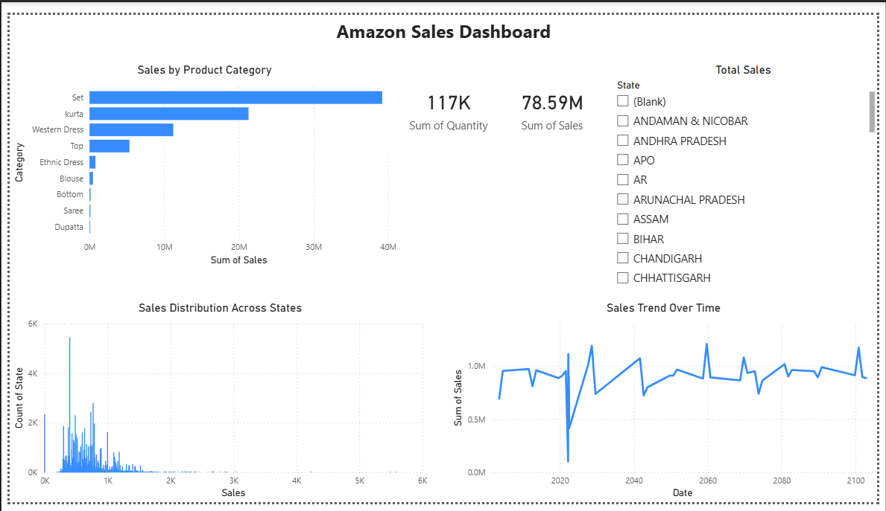

# FUTURE_DS_01
Amazon Sales Data Analysis using Power BI
# Amazon Sales Dashboard – Power BI

## Objective
The objective of this project is to analyze Amazon sales data and create an interactive Power BI dashboard to understand sales performance, top product categories, regional distribution, and sales trends over time.

## Tools Used
- Power BI
- Microsoft Excel
- GitHub

## Dataset
The dataset contains Amazon sales information including:
- Date
- Product Category
- Sales
- Quantity
- State
- City

The dataset used in this project is large and cannot be uploaded directly to GitHub.

You can access the dataset using the link below:
[Click here to access the dataset]([https://drive.google.com/your_csv_link_here](https://drive.google.com/file/d/1TScoTnB7RkQ_4RScaVSRspZLrk1_Wjz2/view?usp=drive_link))

## Dashboard Screenshot

## Business Insights
- The "Set" category generates the highest revenue, making it the top-performing product category.
- Kurta is the second highest-selling category, showing strong customer demand.
- Sales show fluctuations over time but remain generally stable.
- Sales are concentrated in a few states, while many states have low sales contribution.
- Most revenue comes from a limited number of product categories.
